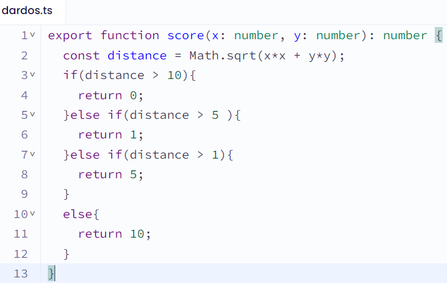
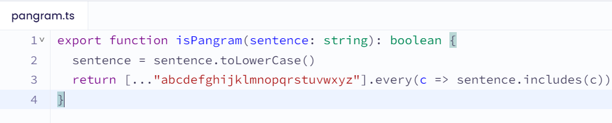

  Teoria explicativa sobre dos ejercisios de Exercism.

# Darts

## Introduccion 
Escribe una función que devuelva los puntos ganados en un solo lanzamiento de un juego de Dardos.
Dardos es un juego en el que los jugadores lanzan dardos a un objetivo .
En nuestro caso particular del juego, el objetivo premia con 4 cantidades diferentes de puntos dependiendo de dónde aterrice el dardo:
Nuestro marcador de dardos con valores desde un fallo total hasta una diana

+ Si el dardo cae fuera del objetivo, el jugador no gana puntos (0 puntos).
+ Si el dardo cae en el círculo exterior del objetivo, el jugador gana 1 punto.
+ Si el dardo cae en el círculo medio del objetivo, el jugador gana 5 puntos.
+ Si el dardo cae en el círculo interior del objetivo, el jugador gana 10 puntos.

El círculo exterior tiene un radio de 10 unidades (esto es equivalente al radio total de todo el objetivo), el círculo del medio tiene un radio de 5 unidades y el círculo interior tiene un radio de 1. Por supuesto, todos están centrados en el mismo punto, es decir, los círculos son concéntricos definidos por las coordenadas (0, 0).

Escribe una función que, dado un punto en el objetivo (definido por sus coordenadas cartesianas x y y, donde xy yson reales ), devuelva la cantidad correcta ganada por un dardo que cae en ese punto.

### Plantamiento

El objetivo de este ejercicio es escribir una función que determine los puntos obtenidos en un lanzamiento de dardos basado en la posición donde el dardo aterriza en el tablero. El tablero de dardos tiene diferentes áreas que otorgan puntos distintos:

+ Si el dardo cae fuera del tablero, el jugador no gana puntos (0 puntos).
+ Si el dardo cae en el círculo exterior del tablero, el jugador gana 1 punto.
+ Si el dardo cae en el círculo medio del tablero, el jugador gana 5 puntos.
+ Si el dardo cae en el círculo interior del tablero (bullseye), el jugador gana 10 puntos.

Las áreas están definidas por círculos concéntricos centrados en el origen (0, 0) con los siguientes radios:

+ Círculo exterior: radio de 10 unidades.
+ Círculo medio: radio de 5 unidades.
+ Círculo interior: radio de 1 unidad.

## Solución 

Explicacion:

#### Declaración de la Función y Exportación:

+ La función `score` está declarada con la palabra clave `export`, para asi permitir varios archivos TypeScript.

+ Tome dos argumentos `(x y y)` de tipo number y devuelve un valor de tipo number.

#### Cálculo de la Distancia:

+ Utilize la fórmula `sqrt(x^2 + y^2)` para calcular la distancia del punto al origen.

#### Condicionales para la Puntuación:

+ Use los condicionales `if-else` para determinar la puntuación según la distancia calculada.

#### Retorno de la Puntuación:

+ Es la función que devuelve la puntuación calculada según las reglas mencionadas anteriormente.

# Parangram 

## Introducción:
Trabajas para una empresa que vende fuentes a través de su sitio web. Les gustaría mostrar una oración diferente cada vez que alguien vea una fuente en su sitio web. Para dar una idea completa de la fuente, las oraciones aleatorias deben usar todas las letras del alfabeto inglés.

Están organizando un concurso para recibir sugerencias de frases que puedan utilizar. Usted está a cargo de verificar los envíos para ver si son válidos.

Nota
Pangram proviene del griego, παν γράμμα, pan gramma, que significa "cada letra".

El pangrama inglés más conocido es:

El veloz zorro marrón salta sobre el perro perezoso.

## Instrucciones
Tu tarea es descubrir si una oración es un pangrama.

Un pangrama es una oración que utiliza cada letra del alfabeto al menos una vez. No distingue entre mayúsculas y minúsculas, por lo que no importa si una letra está en minúscula (por ejemplo k) o en mayúscula (por ejemplo K).

Para este ejercicio, una oración es un pangrama si contiene cada una de las 26 letras del alfabeto inglés.

### Plantamiento

El objetivo del ejercicio es crear una función `isPangram` que verifique si una frase contiene todas las letras del alfabeto inglés al menos una vez. La función convierte la frase a minúsculas y luego verifica si cada letra del alfabeto está presente en la frase utilizando el método `.every() y .includes().` Si todas las letras están presentes, la función devuelve true, indicando que la frase es un pangrama; de lo contrario, devuelve `false`.

## Solución 

Explicacion:

- `sentence = sentence.toLowerCase()`: Esta línea convierte la oración a minúsculas utilizando el método `toLowerCase()`. Esta conversión es esencial para que la función no distinga entre letras mayúsculas y minúsculas al verificar la presencia de todas las letras del alfabeto.

- `[..."abcdefghijklmnopqrstuvwxyz"]`: Esta parte del código crea un array de caracteres que representan todas las letras del alfabeto inglés en minúsculas. La sintaxis `[...]` se conoce como spread operator y se emplea para generar el array de manera más conveniente que escribiendo cada letra por separado.

- `.every(c => sentence.includes(c))`: Aquí se utiliza el método `.every()` de los arrays para verificar si cada letra del alfabeto está presente en la oración. Para cada letra `c` en el array de letras del alfabeto, se verifica si está presente en la oración utilizando el método `.includes()`. El método `.every()` devuelve `true` si todas las verificaciones son `true`, es decir, si todas las letras del alfabeto están presentes en la oración.

En resumen, el objetivo de este ejercisio es determinar si la frase o oracion proporcionada contiene todas las letras del alfabeto inglés al menos una vez, sin importar las mayúsculas o minúsculas.

### Link por youtube para una explicacion mas detallada:

Link por youtube:  